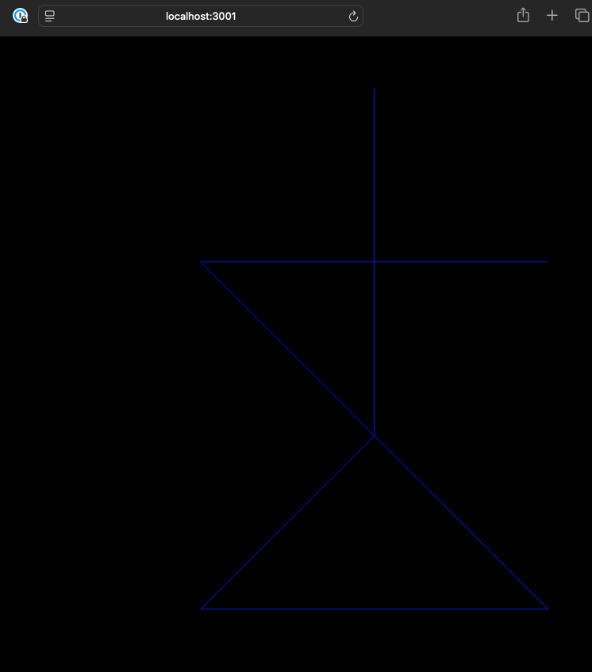

# Concept

Was mooted on discord, that it might be nice to have an AI write facades to scala JS on our behalf.

## Did it work?

On my computer at least once. If you want to have a go, clone the repo, check that you have the dependancies in place and then;

`scala-cli run .`

You'll be asked to prompt if it's correctly written the typescript code, and then the scala-cli code, so you'll have to run it in terminal, and occasionally you'll see messages like;
e.g.

```
I need guidance with: Can you please check if the stickman is displayed correctly at http://localhost:3001?
```
Type yes press enter if it looks sensible.

The last message it prints should look something like this if successful;

```
AiMessage(assistant,Some(Great! Both the TypeScript and Scala.js versions of the stickman are displayed correctly. Here are the locations of the code:

- **TypeScript Code**: `/var/folders/b7/r2s8sm653rj8w9krmxd2748w0000gn/T/typescript-stickman12577871342246737033`
  - View it running at [http://localhost:3001](http://localhost:3001)

- **Scala.js Code**: `/var/folders/b7/r2s8sm653rj8w9krmxd2748w0000gn/T/scalajs-stickman5426030735826916507`
  - View it running at [http://localhost:3002](http://localhost:3002)

```

And I got some browser windows of this stickman.



AI has a weird stickman interpretation.

## Is it useful?

I honestly don't know. It satisfied my curiosity, I don't know how it would hold up for libraries other than three.js, more complex facades etc.

YMMV.

## Is it reliable?

The process does seem to work, but some (non-trivial) percentage of the time, the AI seems to struggle getting the typescript right. Once it get the typescript right, quite often it seems to be able to follow it through in scalaJS.

## Cost

I spent 1.29 USD (1 dollar) on openAI's API on hamster wheel of getting this to work.

## Dependancies

- Typescript compiler
- scala-cli
- an API key for openAI API, which available as the environment variable `OPEN_AI_API_TOKEN`
- JVM > 18 for the simple web sever

I have a .envrc file and [direnv](https://direnv.net) which contains this (truncated) first line and the other stuff is already lying around in my environment.

`export OPEN_AI_API_TOKEN=sk-c0`

## Security

As it's now 2025, no one cares about security anymore and I'm claiming this repo is not malicious.

It is however worth noting, that this does empower your AI with tools providing arbitrary file system and code execution rights. I have no reason to believe it would not suceed given a malicious prompt. Please note; that is _your_ problem, it is not _my_ problem.

If _you_ care about security, then _you_ could consider running this in a sandbox. Just sayin'.
